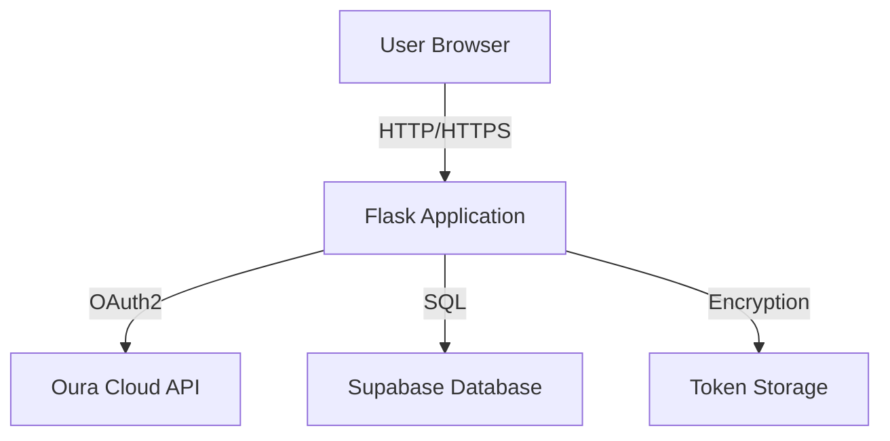
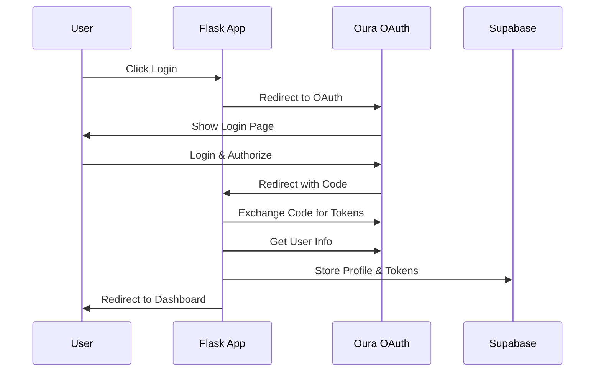
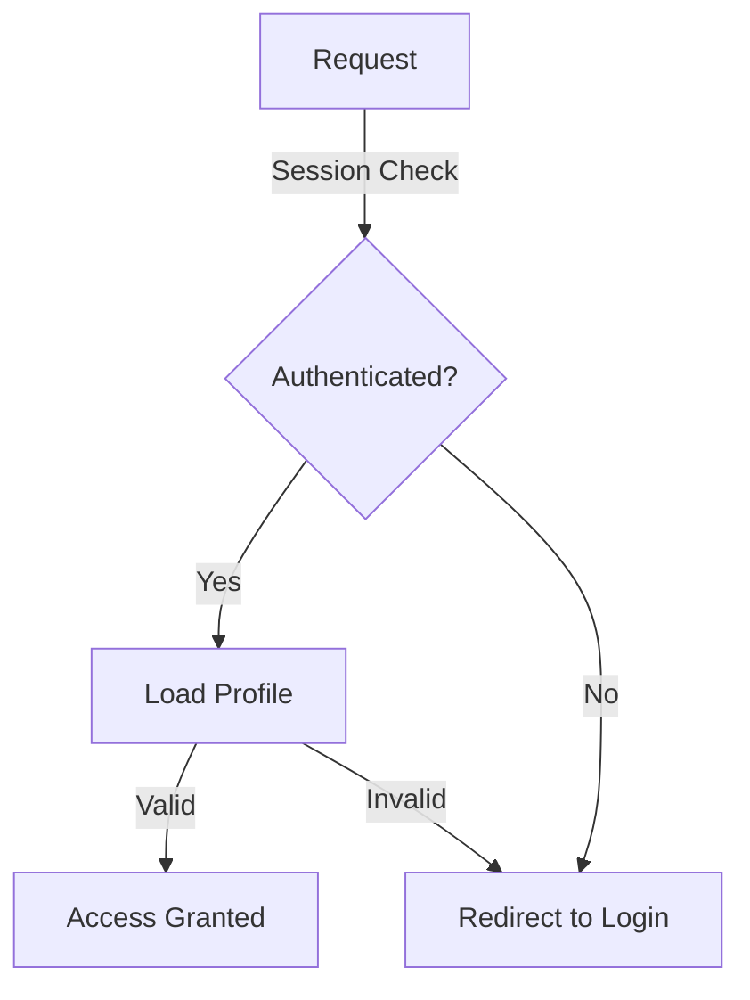

# Architecture Overview

## System Components



## Component Details

### 1. Flask Application (Backend)

The Flask application serves as the main backend, handling:

- HTTP request routing
- OAuth2 flow management
- Token encryption/decryption
- Data aggregation and processing
- User session management

Key Files:
- `app.py`: Main application file
- `config.py`: Configuration management
- `models.py`: Data models
- `utils.py`: Helper functions

### 2. Database (Supabase)

Supabase provides a managed PostgreSQL database with:

- Row Level Security (RLS)
- Real-time capabilities
- Built-in authentication (optional)
- Automatic backups

Tables:
- `profiles`: User profiles
- `oura_tokens`: Encrypted OAuth tokens
- `friendships`: User relationships

### 3. Authentication Flow



### 4. Data Flow

1. **Token Management**
   - Tokens are encrypted before storage
   - Encryption key stored in environment variables
   - Automatic token refresh mechanism

2. **User Data Flow**
   ```mermaid
   graph LR
       A[Flask] -->|Encrypted Token| B[Supabase]
       A -->|Bearer Token| C[Oura API]
       C -->|User Data| A
       A -->|Processed Data| D[Browser]
   ```

3. **Friend Management**
   - Bidirectional friendship model
   - Privacy controls for data sharing
   - Cached friend lists for performance

## Security Architecture

### 1. Data Protection

- All OAuth tokens encrypted at rest
- Secure key management
- HTTPS enforcement
- Session security

### 2. Access Control



### 3. Database Security

- Row Level Security (RLS) policies
- Encrypted sensitive data
- Service role separation
- Connection pooling

## API Structure

### Internal Routes

- `/`: Home/landing page
- `/login`: Initiates OAuth flow
- `/callback`: OAuth callback handler
- `/dashboard`: Main user interface
- `/api/friends`: Friend management
- `/api/compare`: Data comparison

### External API Integration

- Oura API v2 endpoints
- Personal info endpoint
- Sleep data endpoint
- Daily activity endpoint

## Performance Considerations

1. **Caching Strategy**
   - Session caching
   - Friend list caching
   - API response caching

2. **Database Optimization**
   - Indexed queries
   - Connection pooling
   - Query optimization

3. **API Rate Limiting**
   - User-based limits
   - Global application limits
   - Cached responses

## Monitoring and Logging

1. **Application Monitoring**
   - Error tracking
   - Performance metrics
   - User activity logs

2. **Database Monitoring**
   - Query performance
   - Connection pool status
   - Storage utilization

3. **External API Monitoring**
   - Response times
   - Error rates
   - Rate limit tracking

## Future Scalability

1. **Horizontal Scaling**
   - Multiple application instances
   - Load balancing
   - Session management

2. **Database Scaling**
   - Read replicas
   - Connection pooling
   - Query optimization

3. **Caching Layer**
   - Redis integration
   - Distributed caching
   - Cache invalidation 