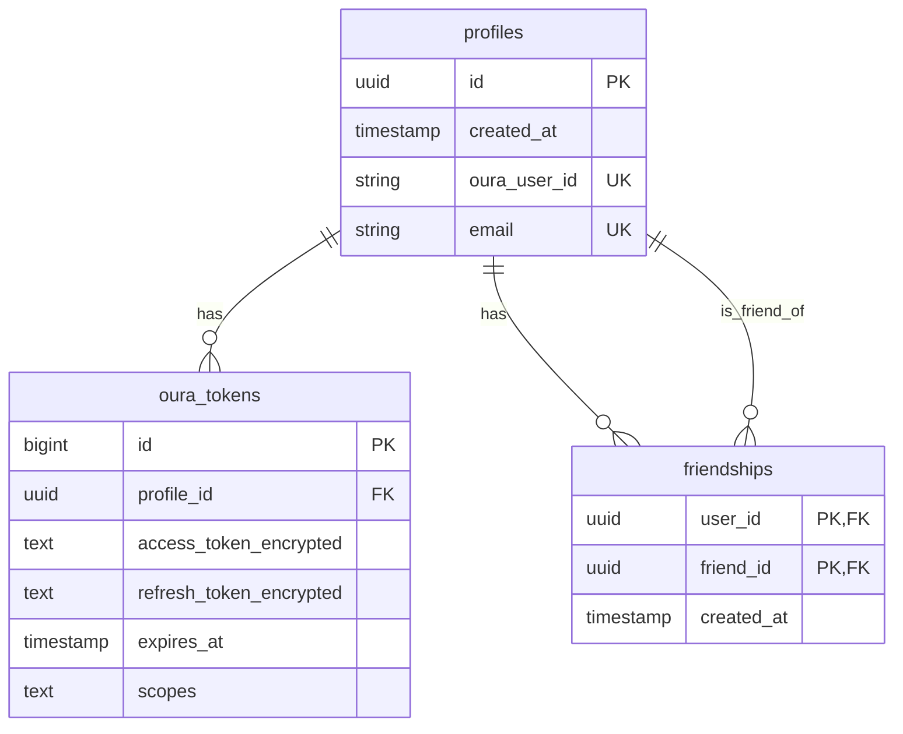

# Database Schema

## Overview

The application uses Supabase (PostgreSQL) as its database. This document details the database schema, relationships, and important considerations for each table.

## Entity Relationship Diagram



## Tables

### profiles

Stores user profile information.

```sql
create table profiles (
    id uuid primary key default uuid_generate_v4(),
    created_at timestamp with time zone default now(),
    oura_user_id text unique not null,
    email text unique
);

-- Indexes
create index idx_profiles_oura_user_id on profiles(oura_user_id);
```

#### Columns
- `id`: Primary key, UUID v4
- `created_at`: Timestamp of profile creation
- `oura_user_id`: Unique identifier from Oura API
- `email`: User's email (optional)

#### Indexes
- Primary Key: `id`
- Unique Index: `oura_user_id`
- Unique Index: `email`

### oura_tokens

Stores encrypted OAuth tokens for each user.

```sql
create table oura_tokens (
    id bigint primary key generated always as identity,
    profile_id uuid references profiles(id) unique not null,
    access_token_encrypted text not null,
    refresh_token_encrypted text,
    expires_at timestamp with time zone not null,
    scopes text
);

-- Indexes
create index idx_oura_tokens_profile_id on oura_tokens(profile_id);
```

#### Columns
- `id`: Primary key, auto-incrementing
- `profile_id`: Foreign key to profiles.id
- `access_token_encrypted`: Encrypted OAuth access token
- `refresh_token_encrypted`: Encrypted OAuth refresh token
- `expires_at`: Token expiration timestamp
- `scopes`: Granted OAuth scopes

#### Indexes
- Primary Key: `id`
- Foreign Key: `profile_id`
- Unique constraint on `profile_id`

### friendships

Manages bidirectional friendships between users.

```sql
create table friendships (
    user_id uuid references profiles(id),
    friend_id uuid references profiles(id),
    created_at timestamp with time zone default now(),
    primary key (user_id, friend_id)
);

-- Indexes
create index idx_friendships_user_id on friendships(user_id);
create index idx_friendships_friend_id on friendships(friend_id);
```

#### Columns
- `user_id`: Foreign key to profiles.id
- `friend_id`: Foreign key to profiles.id
- `created_at`: Timestamp of friendship creation

#### Indexes
- Composite Primary Key: `(user_id, friend_id)`
- Index: `user_id`
- Index: `friend_id`

## Row Level Security (RLS)

### profiles Table

```sql
alter table profiles enable row level security;

-- Allow users to read their own profile
create policy "Users can read own profile"
    on profiles for select
    using (id = auth.uid());

-- Allow users to update their own profile
create policy "Users can update own profile"
    on profiles for update
    using (id = auth.uid());
```

### oura_tokens Table

```sql
alter table oura_tokens enable row level security;

-- Allow users to read their own tokens
create policy "Users can read own tokens"
    on oura_tokens for select
    using (profile_id = auth.uid());

-- Allow users to update their own tokens
create policy "Users can update own tokens"
    on oura_tokens for update
    using (profile_id = auth.uid());
```

### friendships Table

```sql
alter table friendships enable row level security;

-- Allow users to read their own friendships
create policy "Users can read own friendships"
    on friendships for select
    using (user_id = auth.uid() or friend_id = auth.uid());

-- Allow users to create friendships involving themselves
create policy "Users can create own friendships"
    on friendships for insert
    with check (user_id = auth.uid());

-- Allow users to delete their own friendships
create policy "Users can delete own friendships"
    on friendships for delete
    using (user_id = auth.uid());
```

## Data Integrity

### Foreign Key Constraints

```sql
-- oura_tokens foreign key
alter table oura_tokens
    add constraint fk_oura_tokens_profile
    foreign key (profile_id)
    references profiles(id)
    on delete cascade;

-- friendships foreign keys
alter table friendships
    add constraint fk_friendships_user
    foreign key (user_id)
    references profiles(id)
    on delete cascade;

alter table friendships
    add constraint fk_friendships_friend
    foreign key (friend_id)
    references profiles(id)
    on delete cascade;
```

### Check Constraints

```sql
-- Prevent self-friendships
alter table friendships
    add constraint check_no_self_friendship
    check (user_id != friend_id);

-- Ensure token expiration is in the future
alter table oura_tokens
    add constraint check_token_expiration
    check (expires_at > now());
```

## Migrations

Example migration file structure:

```sql
-- 001_initial_schema.sql
create table profiles ( ... );
create table oura_tokens ( ... );
create table friendships ( ... );

-- 002_add_indexes.sql
create index idx_profiles_oura_user_id on profiles(oura_user_id);
create index idx_oura_tokens_profile_id on oura_tokens(profile_id);
create index idx_friendships_user_id on friendships(user_id);
create index idx_friendships_friend_id on friendships(friend_id);

-- 003_add_rls.sql
alter table profiles enable row level security;
create policy "Users can read own profile" on profiles ...
```

## Backup and Recovery

Supabase provides automatic backups:
- Daily backups retained for 7 days
- Point-in-time recovery available
- Manual backup/restore through dashboard

## Performance Considerations

1. **Indexing Strategy**
   - Indexed foreign keys
   - Indexed unique constraints
   - Composite indexes for common queries

2. **Query Optimization**
   - Use prepared statements
   - Implement connection pooling
   - Cache frequent queries

3. **Data Archival**
   - Implement data retention policies
   - Archive old token data
   - Clean up expired friendships 